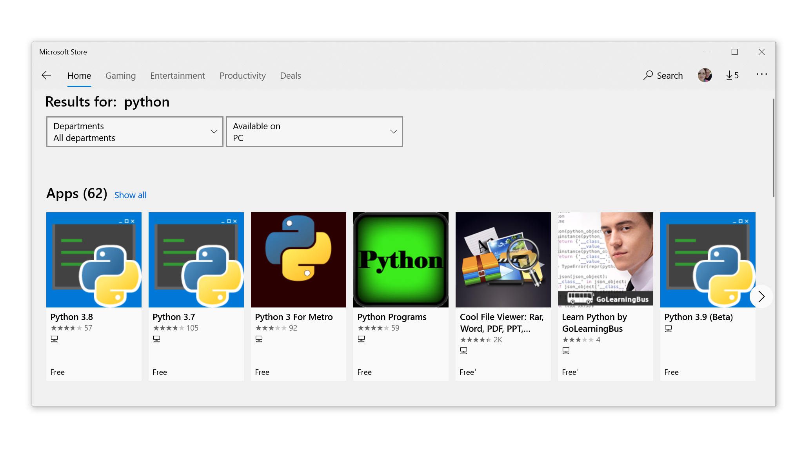
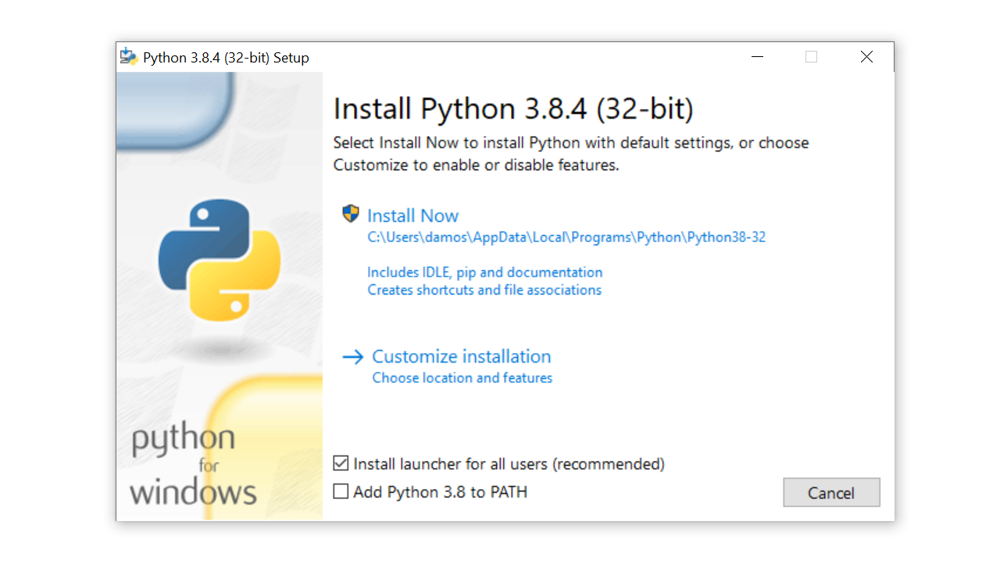
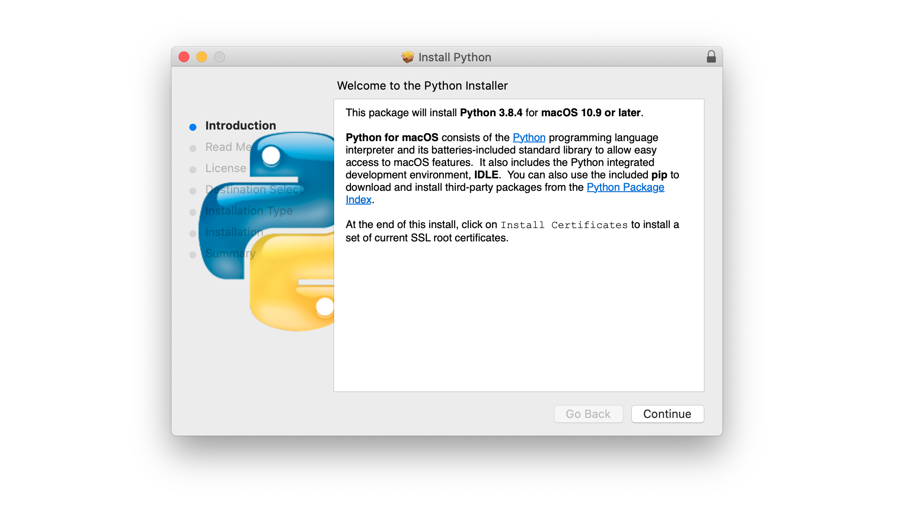

# Instalación de python

Existen diferentes formas de instalar python en tu computador, pero este tutorial se enfoca en las opcione oficiales, porque resultan las mejores opciones para alguien que está comenzando con este lenguaje.

## Como instalar python en Windows

Existen tres opciones para instalar python en windows:
1. El "Microsoft Store"
1. El instalador completo.
1. Windows Sybsystem for Linux

Pero antes de instalar, vamos a verificar si el python está o no instalado en nuestra máquina.

### ¿Cómo verificar la versión de python instalada en Windows?

En esta primera sección, revisaremos si existe previamente instalada una versión de python en la computadora.

Para esto, podemos hacer esto:
1. Abrir powershell / cmd.exe.
1. Escribir en el terminal: 
    ```powershell
    C:C:\> python --version
    ```
1. **Si** ya tienes python insalado, verás:
   ```powershell
   Python 3.9.1
   ```
1. En caso de **no** tenerlo instalado te aparecerá un error o se abrirá una vista del microsoft store para que lo descargues.

Si estás interesado en saber cómo verificar "Dónde" se encuentra almacenado tu intérprete de python, debes ejecutar: `C:\> where.exe python` en la misma terminal, cmd o powershell.

### ¿Qué opciones tiene para instalar python en windows?

Como se ha mencionado anteriormente, hay tres formas de instalar la distribución oficial de Python en Windows:

- **Paquete de la Tienda Microsoft:** El método de instalación más sencillo en Windows implica la instalación desde la aplicación Microsoft Store. Se recomienda para los usuarios principiantes de Python que buscan una experiencia interactiva fácil de configurar.

- **Instalador completo:** Este método implica la descarga de Python directamente desde el sitio web Python.org. Se recomienda para desarrolladores intermedios y avanzados que necesitan más control durante el proceso de instalación.

- **Subsistema de Windows para Linux (WSL):** El WSL permite ejecutar un entorno Linux directamente en Windows. Puede aprender a habilitar el WSL leyendo la Guía de instalación del subsistema de Windows para Linux para Windows 10. *Esta es la opción favorita de muchos desarrolladores que trabajan con python con buen background de linux en un entorno de windows a día de hoy (2021).*

En esta sección, nos centraremos sólo en las dos primeras opciones, que son los métodos de instalación más populares en un entorno Windows.

> Nota: También puedes completar la instalación en Windows utilizando distribuciones alternativas, como Anaconda, pero este tutorial sólo cubre las distribuciones oficiales. Anaconda es una plataforma popular para hacer computación científica y ciencia de datos con Python.

Los dos instaladores oficiales de Python para Windows no son idénticos. El paquete de Microsoft Store tiene algunas limitaciones importantes.

#### Limitaciones del paquete de Microsoft Store

La documentación oficial de Python dice lo siguiente sobre el paquete Microsoft Store:

> El paquete Microsoft Store es un intérprete de Python de fácil instalación que está pensado principalmente para un uso interactivo, por ejemplo, por parte de los estudiantes.
*Fuente:* https://docs.python.org/3/using/windows.html#the-microsoft-store-package

La importante es que el paquete Microsoft Store está "pensado principalmente para un uso interactivo". Es decir, el paquete Microsoft Store está diseñado para ser utilizado por estudiantes y personas que aprenden a usar Python por primera vez.

Además de estar dirigido a los principiantes de Python, el paquete Microsoft Store tiene limitaciones que lo hacen poco adecuado para un entorno de desarrollo profesional. En particular, no tiene acceso total de escritura a ubicaciones compartidas como TEMP o el registro.

#### Recomendaciones del instalador de Windows

Si eres nuevo en Python y te centras principalmente en el aprendizaje del lenguaje más que en la creación de software profesional, entonces deberías instalar desde el paquete de Microsoft Store. Esto ofrece el camino más corto y más fácil para empezar con un mínimo de molestias.

Por otro lado, si eres un desarrollador experimentado que busca desarrollar software profesional en un entorno Windows, entonces el instalador oficial de Python.org es la elección correcta. Tu instalación no estará limitada por las políticas de la tienda de Microsoft, y puedes controlar dónde se instala el ejecutable e incluso añadir Python al PATH si es necesario.

#### Cómo instalar desde la Microsoft Store

Si eres nuevo en Python y quieres empezar rápidamente, el paquete de la Microsoft Store es la mejor manera de empezar a trabajar sin complicaciones. Puedes instalar desde la Microsoft Store en dos pasos.

**Paso #1:** Abrir la página de la aplicación Python en la Microsoft Store

Abre la aplicación Microsoft Store y busca Python.

Probablemente verás varias versiones que puedes elegir para instalar:



Selecciona Python 3.8, o el número de versión más alto que veas disponible en la aplicación, para abrir la página de instalación.

```
Advertencia: Asegúrate de que la aplicación de Python que has seleccionado ha sido creada por la Python Software Foundation.

El paquete oficial de Microsoft Store siempre será gratuito, así que si la aplicación cuesta dinero, entonces es la aplicación equivocada.
```

Como alternativa, puede abrir PowerShell y escribir el siguiente comando:

```Powershell
C:\> python
```

Si aún no tienes una versión de Python en tu sistema, cuando pulses Enter, la Microsoft Store se iniciará automáticamente y te llevará a la última versión de Python en la tienda.

**Paso #2:** Instalar la aplicación Python

Una vez seleccionada la versión a instalar, sigue estos pasos para completar la instalación:

1. Haga clic en Obtener.
1. Espera a que la aplicación se descargue. Cuando termine de descargarse, el botón Obtener será reemplazado por un botón que dice Instalar en mis dispositivos.
1. Haz clic en Instalar en mis dispositivos y selecciona los dispositivos en los que deseas completar la instalación.
1. Haz clic en Instalar ahora y luego en Aceptar para iniciar la instalación.
1. Si la instalación se ha realizado correctamente, verás el mensaje "Este producto está instalado" en la parte superior de la página de Microsoft Store.

¡Felicidades! Ahora tienes acceso a Python, incluyendo pip e IDLE.

#### Cómo instalar desde el instalador completo

Para los desarrolladores profesionales que necesitan un entorno de desarrollo de Python con todas las funciones, la instalación desde el instalador completo es la elección correcta. Ofrece más personalización y control sobre la instalación que la instalación desde la Microsoft Store.

Puedes instalar desde el instalador completo en dos pasos.

**Paso #1:** Descargar el instalador completo

Siga estos pasos para descargar el instalador completo:

1. Abra una ventana del navegador y navegue hasta la página de descargas de [Python.org](https://python.org) para Windows.

1. Bajo el título "Python Releases for Windows", haz clic en el enlace de la última versión de Python 3 - Python 3.x.x. En el momento de escribir este artículo, la última versión era Python 3.9.1.
1. Desplázate hasta la parte inferior y seleccione el instalador ejecutable de Windows x86-64 para 64 bits o el instalador ejecutable de Windows x86 para 32 bits.

Si no estás seguro de si seleccionar el instalador de 32 bits o el de 64 bits, puedes seguir las siguientes indicaciones

> En el caso de Windows, puedes elegir el instalador de 32 bits o el de 64 bits. Esta es la diferencia entre ambos: 
>
> Si su sistema tiene un procesador de 32 bits, entonces debe elegir el instalador de 32 bits. Si intenta instalar la versión de 64 bits en un procesador de 32 bits, obtendrá un error al principio y la instalación fallará.
>
> En un sistema de 64 bits, cualquiera de los dos instaladores funcionará para la mayoría de los propósitos. La versión de 32 bits generalmente utilizará menos memoria, pero la versión de 64 bits funciona mejor para aplicaciones con cálculos intensivos.
>
> Si no está seguro de qué versión elegir, opte por la de 64 bits.
>
> Si tienes un sistema de 64 bits y quieres cambiar de Python de 64 bits a 32 bits (o viceversa), entonces puedes simplemente desinstalar Python y luego volver a instalarlo descargando el otro instalador de [Python.org](https://python.org).

Cuando termine de descargar, ve al siguiente paso.

**Paso #2:** Ejecutar el instalador

Una vez que haya elegido y descargado un instalador, ejecútalo haciendo doble clic en el archivo descargado. Aparecerá un cuadro de diálogo como el siguiente:



Hay cuatro cosas que hay que tener en cuenta en este cuadro de diálogo:

1. La ruta de instalación por defecto está en el directorio AppData/ del usuario actual de Windows.
1. El botón Personalizar la instalación puede utilizarse para personalizar la ubicación de la instalación y las características adicionales que se instalan, incluyendo pip e IDLE.
1. La casilla Instalar el lanzador para todos los usuarios (recomendado) está marcada por defecto. Esto significa que todos los usuarios de la máquina tendrán acceso al lanzador py.exe. Puedes desmarcar esta casilla para restringir Python al usuario actual de Windows.
1. La casilla "Añadir Python 3.8 al PATH" está desmarcada por defecto. Hay [varias razones](https://discuss.python.org/t/could-we-add-python-to-system-path-by-default/3067) por las que podría no querer Python en el PATH, así que asegúrese de entender las implicaciones antes de marcar esta casilla.

El instalador completo le da un control total sobre el proceso de instalación.

> **Advertencia:** Si no sabes lo que es PATH, entonces es muy recomendable que **no** instales con el instalador completo. Utiliza el paquete de Microsoft Store en su lugar.

Personalice la instalación para satisfacer sus necesidades utilizando las opciones disponibles en el cuadro de diálogo. A continuación, haga clic en Instalar ahora. ¡Eso es todo!

¡Felicidades! ya tienes la última versión de Python 3 en tu máquina Windows.

## Como instalar python en MacOS

Python 2 viene preinstalado en versiones antiguas de macOS. Esto ya no es así en las versiones actuales de macOS, [a partir de macOS Catalina](https://developer.apple.com/documentation/macos-release-notes/macos-catalina-10_15-release-notes#Scripting-Language-Runtimes).

Hay dos métodos de instalación en macOS:

1. El instalador oficial
1. El gestor de paquetes Homebrew

En esta sección, aprenderás a comprobar qué versión de Python, si la hay, está instalada en tu dispositivo macOS. También aprenderás cuál de los dos métodos de instalación debes utilizar.

### ¿Cómo verificar la versión de python instalada en MacOS?

Para comprobar qué versión de Python tiene en su Mac, abra primero una aplicación de línea de comandos, como Terminal.

> Nota: Así es como se abre el Terminal:
>
> 1. Pulse las teclas Cmd+Espacio.
> 1. Escriba Terminal.
> 1. Pulsa Intro.
> 
> También puede abrir el Finder y navegar hasta Aplicaciones → Utilidades → Terminal.

Con la línea de comandos abierta, escriba los siguientes comandos:

```bash
# Check the system Python version
$ python --version

# Check the Python 2 version
$ python2 --version

# Check the Python 3 version
$ python3 --version
```

Si tienes Python en tu sistema, entonces uno o más de estos comandos deberían responder con un número de versión.

Por ejemplo, si Python 3.6.10 ya estuviera configurado en tu ordenador, entonces el comando python3 mostraría ese número de versión:

```bash
$ python3 --version
Python 3.6.10
```

Querrás obtener la última versión de Python si alguna de estas condiciones es cierta:

- Ninguno de los comandos anteriores devuelve un número de versión.
- La única versión que ves mostrada está en la serie de Python 2.X.
- Tienes una versión de Python 3 que no es la última disponible, que era la versión 3.8.4 en el momento de escribir este artículo.

### ¿Qué opciones tiene para instalar python en MacOS?

Hay dos maneras de instalar la distribución oficial de Python en macOS:

1. El instalador oficial: Este método consiste en descargar el instalador oficial desde el sitio web Python.org y ejecutarlo en tu máquina.
1. El gestor de paquetes Homebrew: Este método consiste en [descargar](https://brew.sh) e instalar el gestor de paquetes Homebrew si no lo tienes ya instalado, y luego escribir un comando en una aplicación de terminal.

Tanto el instalador oficial como el gestor de paquetes Homebrew funcionan, pero sólo el instalador oficial es mantenido por la Python Software Foundation.

> Nota: También puedes completar la instalación en macOS utilizando distribuciones alternativas, como [Anaconda](https://www.anaconda.com/), pero este tutorial sólo cubre las distribuciones oficiales.
>
> Anaconda es una plataforma popular para hacer computación científica y ciencia de datos con Python. Para aprender a instalar Anaconda en macOS, consulta [la guía de instalación en macOS](https://docs.anaconda.com/anaconda/install/mac-os/) de la documentación oficial de Anaconda.

Las distribuciones instaladas por el instalador oficial y el gestor de paquetes Homebrew no son idénticas. La instalación desde Homebrew tiene algunas limitaciones.

#### Limitaciones de la instalación desde Homebrew

La distribución de Python para macOS disponible en Homebrew no incluye la dependencia Tcl/Tk requerida por el módulo Tkinter. Tkinter es el módulo de la biblioteca estándar para el desarrollo de interfaces gráficas de usuario en Python y es, de hecho, una interfaz para el kit de herramientas Tk GUI, que no forma parte de Python.

Homebrew no instala la dependencia del kit de herramientas Tk GUI. En su lugar, se basa en una versión existente instalada en su sistema. La versión del sistema de Tcl/Tk puede estar obsoleta o faltar por completo y podría impedirte importar el módulo Tkinter.

#### Recomendaciones para el instalador de macOS

El gestor de paquetes Homebrew es un método popular para instalar Python en macOS porque es fácil de manejar desde la línea de comandos y ofrece comandos para actualizar Python sin tener que ir a un sitio web. Como Homebrew es una utilidad de línea de comandos, puede automatizarse con scripts de bash.

Sin embargo, la distribución de Python que ofrece Homebrew no está controlada por la Python Software Foundation y podría cambiar en cualquier momento. El método más fiable en macOS es usar el instalador oficial, especialmente si planeas hacer programación GUI de Python con [Tkinter](https://realpython.com/python-gui-tkinter/).

#### Cómo instalar desde el instalador oficial

Instalar Python desde el instalador oficial es el método de instalación más fiable en macOS. Incluye todas las dependencias del sistema necesarias para desarrollar aplicaciones con Python.

Puedes instalar desde el instalador oficial en dos pasos.

**Paso 1:** Descargar el instalador oficial

Sigue estos pasos para descargar el instalador completo:

1. Abra una ventana del navegador y navegue hasta la página de descargas de [Python.org](https://Python.org) para macOS.
1. Bajo el título "Python Releases for Mac OS X", haz clic en el enlace de la última versión de Python 3 - Python 3.x.x. En el momento de escribir este artículo, la última versión era Python 3.9.1.
1. Desplázate hasta el final y haz clic en el instalador de macOS 64 bits para iniciar la descarga.

Cuando el instalador termine de descargarse, pasa al siguiente paso.

**Paso 2:** Ejecuta el instalador

Ejecute el instalador haciendo doble clic en el archivo descargado. Debería ver la siguiente ventana:



Siga estos pasos para completar la instalación:

1. Dale clic en "Continuar" unas cuantas veces hasta que se te pida que aceptes el acuerdo de licencia del software. A continuación, haz clic en Aceptar.
1. Aparecerá una ventana que te indica el destino de la instalación y el espacio que ocupará. Lo más probable es que no quieras cambiar la ubicación predeterminada, así que sigue adelante y haz clic en Instalar para iniciar la instalación.
1. Cuando el instalador termine de copiar los archivos, haz clic en Cerrar para cerrar la ventana del instalador.

Enhorabuena, ya tienes la última versión de Python 3 en tu ordenador macOS.

#### Cómo instalar con Homebrew

Para los usuarios que necesitan instalar desde la línea de comandos, especialmente aquellos que no van a utilizar Python para desarrollar interfaces gráficas de usuario con el módulo Tkinter, el gestor de paquetes Homebrew es una buena opción. Puedes instalar desde el gestor de paquetes Homebrew en dos pasos.

**Paso 1:** Instalar Homebrew

Si ya tienes Homebrew instalado, puedes saltarte este paso. Si no tienes Homebrew instalado, entonces utiliza el siguiente procedimiento para instalar Homebrew:

1. Abre un navegador y navega hasta http://brew.sh/.
1. Deberías ver un comando para instalar Homebrew cerca de la parte superior de la página bajo la etiqueta "Instalar Homebrew". Este comando será algo como lo siguiente
    ```bash
    $ /bin/bash -c "$(curl -fsSL https://raw.githubusercontent.com/Homebrew/install/master/install.sh)"
    ```
    Resalta el comando con el cursor y pulsa Cmd+C para copiarlo en tu portapapeles.
1. Abre una ventana de terminal y pega el comando, luego presiona Enter. Esto iniciará la instalación de Homebrew.
1. Introduce tu contraseña de usuario de macOS cuando se te pida.

Dependiendo de tu conexión a Internet, la descarga de todos los archivos necesarios para Homebrew puede tardar unos minutos. Una vez completada la instalación, volverás a la pantalla de tu terminal.

> Nota: Si lo haces en una instalación nueva de macOS, es posible que aparezca una alerta emergente que te pida que instales las herramientas de desarrollo de línea de comandos de Apple. Estas herramientas son necesarias para la instalación, por lo que puedes confirmar el cuadro de diálogo haciendo clic en Instalar.
>
> Una vez instaladas las herramientas de desarrollo, tendrás que pulsar Intro para continuar con la instalación de Homebrew.

Ahora que Homebrew está instalado, estás listo para instalar Python.

**Paso 2:** Instalar python

Sigue estos pasos para completar la instalación con Homebrew:

1. Abre una aplicación de terminal.
1. Escribe el siguiente comando para actualizar Homebrew:
    ```bash
    $ brew update && brew upgrade
    ```

La instalación con Homebrew es ahora tan sencilla como ejecutar el comando `brew install python3`. Esto descargará e instalará la última versión de Python en su máquina.

Puedes asegurarte de que todo ha ido correctamente probando si puedes acceder a Python desde la terminal:

1. Abre un terminal.
1. Escribe `pip3` y pulse Enter.
1. Deberías ver el texto de ayuda del gestor de paquetes pip de Python. Si recibes un mensaje de error al ejecutar pip3, vuelve a realizar los pasos de instalación para asegurarte de que la instalación funciona.

¡Felicidades! ya tienes Python en tu sistema macOS.

## Como instalar python en Linux

Hay dos métodos de instalación en Linux:

1. Utilizar el gestor de paquetes de su sistema operativo
1. Construyendo Python desde el código fuente

En esta sección, aprenderás cómo comprobar qué versión de Python, si la hay, está en tu ordenador Linux. También aprenderás cuál de los dos métodos de instalación debes utilizar.

### ¿Cómo verificar la versión de python instalada en Linux?

Muchas distribuciones de Linux vienen empaquetadas con Python, pero probablemente no será la última versión e incluso puede ser Python 2 en lugar de Python 3. Deberías comprobar la versión para asegurarte.

Para saber qué versión de Python tienes, abre una ventana de terminal y prueba los siguientes comandos:

```bash
# Comprueba la versión de Python del sistema
$ python --version

# Comprobar la versión de Python 2
$ python2 --version

# Comprueba la versión de Python 3
$ python3 --version
```

Si tienes Python en tu máquina, entonces uno o más de estos comandos deberían responder con un número de versión.

Por ejemplo, si ya tienes Python 3.6.10 en tu ordenador, entonces el comando `python3 --version` mostrará ese número de versión:

```bash
$ python3 --version
Python 3.6.10
```

Querrás obtener la última versión de Python si tu versión actual está en la serie Python 2.X o no es la última versión de Python 3 disponible, que era la 3.9.1. al momento de escribir este artículo.

### ¿Qué opciones tiene para instalar python en Linux?

Hay dos maneras de instalar la distribución oficial de Python en Linux:

1. Instalar desde un gestor de paquetes: Este es el método de instalación más común en la mayoría de las distribuciones de Linux. Implica ejecutar un comando desde la línea de comandos.
1. Construir desde el código fuente: Este método es más difícil que el uso de un gestor de paquetes. Implica ejecutar una serie de comandos desde la línea de comandos, así como asegurarse de que tienes las dependencias correctas instaladas para compilar el código fuente de Python.

No todas las distribuciones de Linux tienen un gestor de paquetes, y no todos los gestores de paquetes tienen Python en su repositorio de paquetes. Dependiendo de tu sistema operativo, construir Python desde el código fuente puede ser tu única opción.

> Nota: También puedes completar la instalación en Linux utilizando distribuciones alternativas, como Anaconda, pero este tutorial sólo cubre las distribuciones oficiales.
>
> Anaconda es una plataforma popular para hacer computación científica y ciencia de datos con Python. Para aprender a instalar Anaconda en Linux, consulte la guía de instalación de Linux en la documentación oficial de Anaconda.

El método de instalación que utilice se reduce principalmente a si su sistema operativo Linux tiene un gestor de paquetes y si necesita controlar los detalles de la instalación.

#### Recomendaciones de instalación en Linux

La forma más popular de instalar Python en Linux es con el gestor de paquetes de tu sistema operativo, lo cual es una buena opción para la mayoría de los usuarios. Sin embargo, dependiendo de tu distribución de Linux, Python puede no estar disponible a través de un gestor de paquetes. En este caso, necesitarás construir Python desde el código fuente.

Hay tres razones principales por las que puedes elegir construir Python desde el código fuente:

1. No puedes descargar Python desde el gestor de paquetes de tu sistema operativo.
1. Necesitas controlar cómo se compila Python, como cuando quieres reducir la huella de memoria en sistemas embebidos.
1. Quieres probar las versiones beta y las versiones candidatas de la última y mejor versión antes de que esté disponible de forma general.

Para completar la instalación en tu máquina Linux, busca tu distribución de Linux y sigue los pasos indicados, en este artículo, nos enfocaremos en la instalación dentro del sistema operativo Ubuntu.

##### Cómo instalar en Ubuntu y Linux Mint

En esta sección, aprenderás a instalar Python usando el gestor de paquetes apt de Ubuntu. Si quieres construir Python desde el código fuente, salta a la sección Cómo construir Python desde el código fuente.

Dependiendo de la versión de la distribución de Ubuntu que ejecute, el proceso para configurar Python en su sistema variará. Puedes determinar tu versión local de Ubuntu ejecutando el siguiente comando:

```bash
$ lsb_release -a
No LSB modules are available.
Distributor ID: Ubuntu
Description:    Ubuntu 16.04.4 LTS
Release:        16.04
Codename:       xenial
```
Siga las siguientes instrucciones que coinciden con el número de versión que ve bajo Release en la salida de la consola:

- **Ubuntu 18.04, Ubuntu 20.04 y superiores:** Python 3.8 no viene por defecto en Ubuntu 18.04 y superiores, pero está disponible en el repositorio Universe. Para instalar la versión 3.8, abra una aplicación de terminal y escriba los siguientes comandos:
    ```bash
    $ sudo apt-get update
    $ sudo apt-get install python3.8 python3-pip
    ```
    Una vez completada la instalación, puedes ejecutar Python 3.8 con el comando python3.8 y pip con el comando pip3.

- **Linux Mint y Ubuntu 17 e inferiores:** Python 3.8 no está en el repositorio de Universe, por lo que es necesario obtenerlo desde un Archivo de Paquetes Personales (PPA). Por ejemplo, para instalar desde el PPA "deadsnakes", utilice los siguientes comandos:
    ```bash
    $ sudo add-apt-repository ppa:deadsnakes/ppa
    $ sudo apt-get update
    $ sudo apt-get install python3.8 python3-pip
    ```
    Una vez completada la instalación, puede ejecutar Python 3.8 con el comando python3.8 y ejecutar pip con el comando pip3.

¡Felicidades! Ya tienes Python 3 instalado en tu máquina.

#### Cómo construir Python a partir del código fuente

A veces tu distribución de Linux no tiene la última versión de Python, o tal vez sólo quieres ser capaz de construir la última y mejor versión por ti mismo. Aquí están los pasos que necesitas para construir Python desde el código fuente:

**Paso 1:** Descargar el código fuente

Para empezar, necesitas obtener el código fuente de Python. [Python.org](https://Python.org) hace que esto sea bastante sencillo. Si vas a la página de descargas, verás el último código fuente de Python 3 en la parte superior. Sólo asegúrate de que no coges el Python "legacy", ¡Python 2!

Cuando selecciones la versión de Python 3, verás una sección de "Archivos" en la parte inferior de la página. Selecciona el tarball con el código fuente comprimido y descárgalo en tu máquina. Si prefieres un método de línea de comandos, puedes usar wget para descargar el archivo a tu directorio actual:

```bash
$ wget https://www.python.org/ftp/python/3.8.4/Python-3.8.4.tgz
```

Cuando el tarball termine de descargarse, hay algunas cosas que tendrás que hacer para preparar tu sistema para construir Python.

**Paso 2:** Prepara tu sistema

Hay algunos pasos específicos de cada distribución para construir Python desde cero. El objetivo de cada paso es el mismo en todas las distribuciones, pero es posible que tengas que adaptarlo a tu distribución si no utiliza apt-get:

1. Primero, actualiza tu gestor de paquetes y actualiza tus paquetes:

```bash
$ sudo apt-get update
$ sudo apt-get upgrade
```

1. A continuación, asegúrese de que tiene instalados todos los requisitos de compilación:
    ```bash
    # Para sistemas basados en apt (como Debian, Ubuntu y Mint)
    $ sudo apt-get install -y make build-essential libssl-dev zlib1g-dev \
        libbz2-dev libreadline-dev libsqlite3-dev wget curl llvm \N - sudo apt-get -y
        libncurses5-dev libncursesw5-dev xz-utils tk-dev

    # Para sistemas basados en yum (como CentOS)
    $ sudo yum -y groupinstall "Herramientas de desarrollo"
    $ sudo yum -y install gcc openssl-devel bzip2-devel libffi-devel
    ```
    No pasa nada si ya tienes algunos de los requisitos instalados en tu sistema. Puedes ejecutar los comandos anteriores y los paquetes existentes no se sobrescribirán.

Ahora que tu sistema está listo, ¡es hora de empezar a construir Python!

**Paso 3:** Construir python

1. Una vez que tengas los prerrequisitos y el archivo TAR, puedes desempaquetar el código fuente en un directorio. Ten en cuenta que el siguiente comando creará un nuevo directorio llamado Python-3.8.3 bajo el que estás:

    ```bash
    $ tar xvf Python-3.8.4.tgz
    $ cd Python-3.8.4
    ```
1. Ahora necesitas ejecutar la herramienta ./configure para preparar la compilación:
    ```bash
    $ ./configure --enable-optimizations --with-ensurepip=install
    ```
    La opción enable-optimizations habilitará algunas optimizaciones dentro de Python para que se ejecute alrededor de un 10 por ciento más rápido. Hacer esto puede añadir veinte o treinta minutos al tiempo de compilación. La opción with-ensurepip=install instalará pip junto con esta instalación.
1. Ahora, construye Python usando make. La opción -j simplemente le dice a make que divida la construcción en pasos paralelos para acelerar la compilación. Incluso con las compilaciones paralelas, este paso puede tomar varios minutos:
    ```bash
    $ make -j 8
    ```
1. Finalmente, querrás instalar tu nueva versión de Python. Utilizarás el objetivo altinstall aquí para evitar sobrescribir el Python del sistema. Como estás instalando en /usr/bin, necesitarás ejecutar como root:
    ```bash
    $ sudo make altinstall
    ```
Puede tardar un poco en terminar la instalación. Una vez que haya terminado, puedes verificar que Python está configurado correctamente.

**Paso 4:** Verificar la instalación

Comprueba que el comando python3.8 --version devuelve la última versión:

```bash
$ python3.8 --version
Python 3.8.4
```

Si ves Python 3.8.4, ¡entonces estás listo!

Si tienes algo de tiempo extra, también puedes ejecutar el conjunto de pruebas para asegurarte de que todo funciona correctamente en tu sistema.

Para ejecutar el conjunto de pruebas, escriba el siguiente comando:

```bash
$ python3.8 -m test
```

Probablemente querrás encontrar otra cosa que hacer durante un rato, ya que tu computador estará ejecutando las pruebas durante algún tiempo. Si todas las pruebas pasan, entonces puedes estar seguro de que tu nueva construcción de Python está funcionando como se esperaba.

## Conclusión

¡Enhorabuena! Ahora tienes acceso a la última versión de Python para tu sistema. Tu viaje con Python acaba de empezar.

En este tutorial has aprendido cómo:

- Comprobar qué versión de Python, si la hay, está instalada en tu sistema
- Instalar la última versión de Python en Windows, macOS y Linux
- Utilizar Python en dispositivos móviles como teléfonos o tabletas
- Utilizar Python en la Web con intérpretes en línea

Ya estás listo para empezar a programar en Python, ¡a comenzar a practicar!